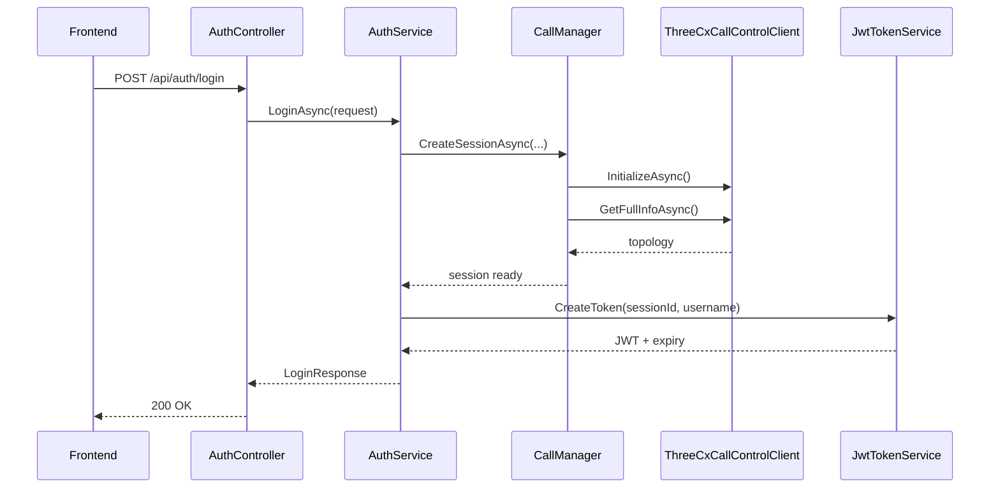
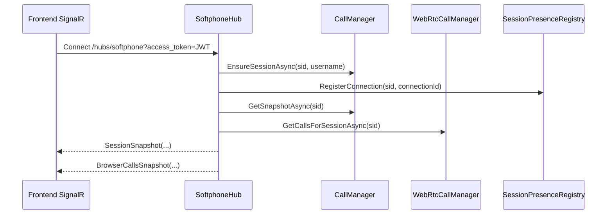
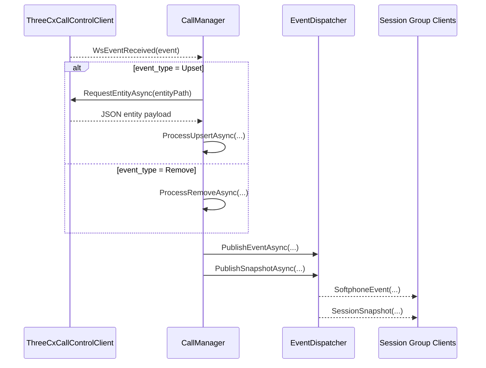
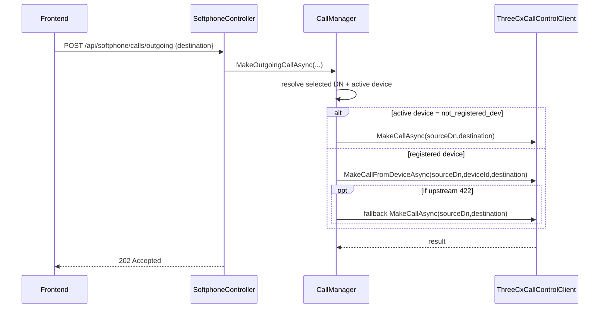
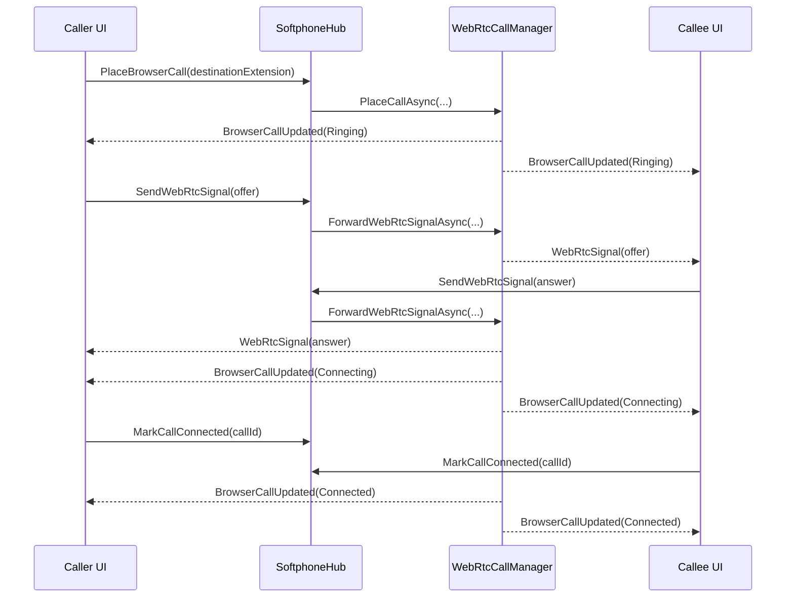

# Backend Deep Documentation

This document explains the backend in beginner-friendly detail, class by class, property by property, and method by method.

Project root for this doc: `backend/`  
Main runtime stack: ASP.NET Core Web API + SignalR + JWT auth + in-memory session state + 3CX Call Control integration.

## 1. What this backend does

The backend has two parallel jobs:

1. 3CX Call Control integration:
   1. Login users from server config.
   2. Create a per-user in-memory softphone session.
   3. Connect to 3CX REST API and 3CX WebSocket.
   4. Track extension devices + participants.
   5. Execute call control actions (answer, reject, transfer, etc.).
   6. Stream call audio downlink/uplink for participants.
2. Browser-to-browser call signaling:
   1. Keep in-memory WebRTC call records between online app users.
   2. Relay WebRTC signaling over SignalR (`offer`, `answer`, `ice`).
   3. Publish call state transitions (`Ringing`, `Connecting`, `Connected`, `Ended`).

No database is used. All runtime state is in memory.

## 2. Startup, dependency injection, and middleware flow

Primary file: `Program.cs`.

### 2.1 Startup configuration order

1. Create builder.
2. Add `softphone.config.json` as optional config source (`reloadOnChange: true`).
3. Bind `Softphone` section to `SoftphoneOptions`.
4. Register:
   1. Controllers
   2. Endpoint explorer
   3. SignalR
   4. HttpClient factory
5. Add CORS policy `SoftphoneCors` (`AllowAnyOrigin/AllowAnyHeader/AllowAnyMethod`).
6. Read `SoftphoneOptions` once to build JWT signing key.
7. Configure JWT bearer authentication:
   1. Validate issuer
   2. Validate audience
   3. Validate signing key
   4. Validate token lifetime
   5. Set 30s clock skew
8. Add JWT bearer event:
   1. If request path starts with `/hubs/softphone`
   2. Read `access_token` query parameter
   3. Use it as bearer token for SignalR websocket auth.
9. Register singleton services:
   1. `JwtTokenService`
   2. `ThreeCxClientFactory`
   3. `SessionRegistry`
   4. `SessionPresenceRegistry`
   5. `EventDispatcher`
   6. `CallManager`
   7. `WebRtcCallManager`
   8. `AuthService`
   9. `SipConfigurationService`
10. Build app and wire middleware:
11. `AppExceptionMiddleware`
12. CORS
13. Authentication
14. Authorization
15. Controllers
16. SignalR hub route `/hubs/softphone`
17. Run app.

### 2.2 Why most services are singleton

This backend keeps active session/call topology in memory. A singleton lifetime means the same in-memory state is visible across all requests/connections for the process lifetime.

## 3. Configuration model and files

### 3.1 Files

1. `appsettings.json`
   1. Logging
   2. `Softphone` defaults (JWT, reconnect policy, users)
2. `softphone.config.json`
   1. 3CX base URL + app credentials
   2. SIP/WebRTC global settings
3. `.env.example`
   1. Example host binding (`ASPNETCORE_URLS`)
4. `Properties/launchSettings.json`
   1. Development launch profiles (project + IIS Express)

### 3.2 `SoftphoneOptions` object tree

`SoftphoneOptions` is the central configuration model:

1. `JwtIssuer`: token issuer value.
2. `JwtAudience`: token audience value.
3. `JwtSigningKey`: symmetric key for signing JWT.
4. `TokenLifetimeMinutes`: JWT TTL in minutes.
5. `MaxWsReconnectAttempts`: 3CX websocket reconnect retry limit.
6. `WsReconnectDelaySeconds`: delay between reconnect attempts.
7. `ThreeCx`:
   1. `PbxBase`: PBX base URL.
   2. `AppId`: OAuth client id/integration id.
   3. `AppSecret`: OAuth client secret.
8. `SipWebRtc`:
   1. `Enabled`
   2. `WebSocketUrl`
   3. `Domain`
   4. `IceServers`
9. `Users[]`:
   1. `Username`
   2. `Password`
   3. `OwnedExtension`
   4. `ControlDn` (optional routepoint DN for call control)
   5. `Sip`:
      1. `Username`
      2. `AuthId`
      3. `Password`
      4. `DisplayName`

## 4. Domain models and what each property means

### 4.1 Authentication and request/response models

1. `LoginRequest`
   1. `username`: app username.
   2. `password`: app password.
2. `LoginResponse`
   1. `accessToken`: JWT.
   2. `expiresAtUtc`: absolute UTC expiry.
   3. `sessionId`: server-side in-memory session key.
   4. `username`: authenticated username.
   5. `pbxBase`: PBX base URL provided to client.

### 4.2 SIP config response model

`SipRegistrationConfigResponse`:

1. `enabled`: if false, frontend should skip SIP registration.
2. `webSocketUrl`: SIP WebSocket endpoint.
3. `domain`: SIP domain.
4. `aor`: SIP Address of Record (e.g. `sip:100@domain`).
5. `authorizationUsername`: SIP auth username.
6. `authorizationPassword`: SIP auth password.
7. `displayName`: display identity.
8. `iceServers`: STUN/TURN list.

### 4.3 Session snapshot models

`SessionSnapshotResponse`:

1. `connected`: backend session exists.
2. `username`
3. `sessionId`
4. `selectedExtensionDn`
5. `ownedExtensionDn`
6. `controlDn`
7. `devices[]` (`SoftphoneDeviceView`)
8. `activeDeviceId`
9. `calls[]` (`SoftphoneCallView`)
10. `wsConnected`: 3CX websocket status.
11. `lastUpdatedUtc`

`SoftphoneDeviceView`:

1. `dn`: extension DN.
2. `deviceId`: 3CX device id.
3. `userAgent`: readable device descriptor.

`SoftphoneCallView`:

1. `participantId`: 3CX participant id.
2. `dn`: source DN where this participant is controlled from.
3. `partyDnType`: DN type like `Wextension` or `Wroutepoint`.
4. `callId`: 3CX call id.
5. `legId`: call leg id.
6. `status`: participant status.
7. `remoteParty`: remote caller number/id.
8. `remoteName`: remote caller name.
9. `direction`: `Incoming`/`Outgoing`.
10. `directControl`: whether participant can be directly controlled.
11. `answerable`: backend-computed boolean for answer action confidence.
12. `connectedAtUtc`: timestamp when participant became connected.

### 4.4 Event envelope model

`SoftphoneEventEnvelope`:

1. `eventType`: semantic event name.
2. `occurredAtUtc`: event creation UTC time.
3. `payload`: dynamic event data object.

### 4.5 3CX topology and event models

1. `ThreeCxDnInfo` (raw API shape):
   1. `dn`
   2. `type`
   3. `devices[]`
   4. `participants[]`
2. `ThreeCxDnInfoModel` (normalized map shape):
   1. `Dn`
   2. `Type`
   3. `Devices` dictionary by `DeviceId`
   4. `Participants` dictionary by `ParticipantId`
3. `ThreeCxDevice`:
   1. `dn`
   2. `device_id`
   3. `user_agent`
4. `ThreeCxParticipant`:
   1. `id`
   2. `status`
   3. `party_caller_name`
   4. `party_dn`
   5. `party_caller_id`
   6. `device_id`
   7. `party_dn_type`
   8. `direct_control`
   9. `callid`
   10. `legid`
   11. `dn`
5. `ThreeCxCallControlResult`:
   1. `finalstatus`
   2. `reason`
   3. `reasontext`
   4. `result` (participant)
6. `ThreeCxWsEvent`:
   1. `sequence`
   2. `event` (`ThreeCxWsEventBody`)
7. `ThreeCxWsEventBody`:
   1. `event_type` (`Upset`, `Remove`, etc.)
   2. `entity` path (`/callcontrol/{dn}/{entityType}/{id}`)

### 4.6 Browser WebRTC models

1. `BrowserCallView`:
   1. `callId`
   2. `status`
   3. `localExtension`
   4. `remoteExtension`
   5. `remoteUsername`
   6. `isIncoming`
   7. `createdAtUtc`
   8. `answeredAtUtc`
   9. `endedAtUtc`
   10. `endReason`
2. `WebRtcSignalRequest`:
   1. `callId`
   2. `type` (`offer`, `answer`, `ice`)
   3. `sdp`
   4. `candidate`
   5. `sdpMid`
   6. `sdpMLineIndex`
3. `WebRtcSignalMessage`:
   1. Same signaling payload plus routing metadata:
   2. `fromExtension`
   3. `toExtension`
   4. `sentAtUtc`

### 4.7 Session runtime model

`SoftphoneSession` keeps all live state per login:

1. Identity and config:
   1. `SessionId`
   2. `Username`
   3. `OwnedExtensionDn`
   4. `ConnectionSettings`
   5. `ThreeCxClient`
2. Runtime maps:
   1. `TopologyByDn`
   2. `Devices`
   3. `Participants`
   4. `ConnectedAtByParticipant`
   5. `DirectionByParticipant`
3. Selection/state:
   1. `SelectedExtensionDn`
   2. `ControlDn`
   3. `ActiveDeviceId`
   4. `WsConnected`
4. Timestamps:
   1. `CreatedAtUtc`
   2. `LastUpdatedUtc`
5. Concurrency lock:
   1. `Gate` (`SemaphoreSlim`)

`DisposeAsync` closes the per-session gate and the underlying 3CX client.

## 5. Constants, enums, and exceptions

`CallControlConstants` contains protocol-level constants:

1. DN types:
   1. `Wextension`
   2. `Wroutepoint`
2. Entity names:
   1. `participants`
   2. `devices`
3. Participant statuses:
   1. `Dialing`
   2. `Ringing`
   3. `Connected`
4. Participant actions:
   1. `answer`
   2. `drop`
   3. `divert`
   4. `transferto`
5. Synthetic device id:
   1. `not_registered_dev` (server-route call mode)

`ClaimTypesEx.SessionId` is custom claim key `sid`.

`ThreeCxEventType` maps websocket event numeric codes:

1. `Upset = 0`
2. `Remove = 1`
3. `DtmfString = 2`
4. `PromptPlaybackFinished = 3`

`SoftphoneCallDirection`:

1. `Incoming`
2. `Outgoing`

Exception model:

1. `AppException` base class with:
   1. `ErrorName`
   2. `ErrorCode`
   3. Message
2. Specialized exceptions:
   1. `BadRequestException` (400)
   2. `UnauthorizedException` (401)
   3. `ForbiddenException` (403)
   4. `NotFoundException` (404)
   5. `InternalServerErrorException` (500)
   6. `UpstreamApiException` (status propagated from 3CX)

## 6. Error middleware and infrastructure helpers

### 6.1 `AppExceptionMiddleware`

Request pipeline behavior:

1. Execute next middleware.
2. If exception is `AppException`:
   1. Set HTTP status to `ErrorCode`
   2. Return JSON:
      1. `name`
      2. `message`
      3. `errorCode`
      4. `traceId`
3. If exception is unknown:
   1. Log server error
   2. Return generic 500 JSON (without exposing internal stack details).

### 6.2 `RequestInputResolver`

Purpose: tolerant field extraction from mixed request shapes.

`ResolveFieldAsync` order:

1. Query string first.
2. Form body second.
3. JSON body third:
   1. Case-insensitive property lookup
   2. Convert string/number/bool to output string
   3. If JSON root is string and raw fallback allowed, use it
4. If still missing and raw fallback enabled, use trimmed raw body.

Important implementation details:

1. Uses request body buffering.
2. Caches raw body and parsed JSON in `HttpContext.Items`.
3. Avoids multiple full body reads in one request.

### 6.3 `CallControlMapFactory`

Converts `IEnumerable<ThreeCxDnInfo>` into `Dictionary<string, ThreeCxDnInfoModel>`:

1. Skip entries with empty DN.
2. Keep only devices with non-empty `DeviceId`.
3. Keep only participants with non-null `Id`.

### 6.4 `ClaimsPrincipalExtensions`

1. `RequireSessionId()`:
   1. read claim `sid`
   2. throw unauthorized if missing
2. `RequireUsername()`:
   1. read `ClaimTypes.NameIdentifier`
   2. throw unauthorized if missing

### 6.5 `EntityPathHelper`

Parses WS entity path:

1. Expected format: `/callcontrol/{dn}/{entityType}/{entityId}`
2. Returns `EntityOperation(Dn, Type, Id)`
3. Returns empty fields if path is invalid.

## 7. Controllers

### 7.1 `AuthController` (`/api/auth`)

1. `POST /login`
   1. Reads `username/password` via `RequestInputResolver`.
   2. Calls `AuthService.LoginAsync`.
   3. Returns `200` with token/session response.
2. `POST /logout` (authorized)
   1. Reads session id from claim.
   2. Calls `AuthService.LogoutAsync`.
   3. Returns `204`.

### 7.2 `SoftphoneController` (`/api/softphone`, authorized)

Endpoints:

1. `GET /session`
2. `GET /extensions`
3. `GET /sip/config`
4. `POST /extensions/select`
5. `POST /devices/active`
6. `POST /calls/outgoing`
7. `POST /calls/{participantId}/answer`
8. `POST /calls/{participantId}/reject`
9. `POST /calls/{participantId}/end`
10. `POST /calls/{participantId}/transfer`
11. `GET /calls/{participantId}/audio`
12. `POST /calls/{participantId}/audio`

Shared internal helper `EnsureSessionAsync`:

1. Read `sid` and username claims.
2. Ask `CallManager` to ensure/recover session.
3. Return session id.

## 8. SignalR hub (`SoftphoneHub`)

Hub route: `/hubs/softphone` (authorized).

### 8.1 Connection lifecycle

`OnConnectedAsync`:

1. Read required session + username claims.
2. Ensure backend session exists.
3. Add connection to session group (`session:{sid}`).
4. Register presence (`SessionPresenceRegistry`).
5. Send caller:
   1. `SessionSnapshot`
   2. `BrowserCallsSnapshot`

`OnDisconnectedAsync`:

1. Remove connection from session group.
2. Unregister presence.
3. End browser call state for disconnected session.

### 8.2 Hub actions

1. `PlaceBrowserCall`
2. `AnswerBrowserCall`
3. `RejectBrowserCall`
4. `EndBrowserCall`
5. `SendWebRtcSignal`
6. `MarkCallConnected`

Execution wrapper behavior (`ExecuteHubActionAsync`):

1. `AppException` -> convert to `HubException` (clean client-facing message).
2. Unknown exception -> log with method + connection id, rethrow.

### 8.3 Client contract (`ISoftphoneHubClient`)

Server-to-client methods:

1. `SessionSnapshot`
2. `SoftphoneEvent`
3. `BrowserCallsSnapshot`
4. `BrowserCallUpdated`
5. `WebRtcSignal`

## 9. Services: high-level map

1. `AuthService`: login/logout orchestration.
2. `JwtTokenService`: token creation/signing.
3. `SipConfigurationService`: build SIP config for frontend.
4. `SessionRegistry`: in-memory session storage.
5. `SessionPresenceRegistry`: online SignalR presence.
6. `EventDispatcher`: publish snapshot/events to session groups.
7. `ThreeCxClientFactory`: construct 3CX transport client with reconnect policy.
8. `ThreeCxCallControlClient`: low-level 3CX HTTP/WS client.
9. `CallManager`: core 3CX topology + call control orchestrator.
10. `WebRtcCallManager`: browser-to-browser call state/signaling manager.

## 10. Service deep dive

### 10.1 `AuthService`

#### `LoginAsync(request, cancellationToken)`

Algorithm:

1. Validate both username and password are provided.
2. Find exact configured user by username.
3. Compare plaintext password exactly (current implementation is config-based demo auth).
4. Ensure user has `OwnedExtension`.
5. Read global 3CX settings (`PbxBase`, `AppId`, `AppSecret`) and validate non-empty.
6. Generate random session id (`Guid.NewGuid().ToString("N")`).
7. Call `CallManager.CreateSessionAsync(...)` with:
   1. generated session id
   2. username
   3. owned extension
   4. optional control DN
   5. 3CX connect settings
8. Generate JWT token using `JwtTokenService.CreateToken`.
9. Return `LoginResponse` including token/session info.

#### `LogoutAsync(sessionId)`

1. Ask `WebRtcCallManager` to close browser-call state for this session.
2. Ask `CallManager` to remove and dispose backend session.

### 10.2 `JwtTokenService`

#### Constructor

1. Load `SoftphoneOptions`.
2. Enforce `JwtSigningKey` minimum length (32).
3. Create symmetric signing key and HMAC-SHA256 signing credentials.

#### `CreateToken(sessionId, username)`

1. Capture current UTC timestamp.
2. Compute expiry from configured minutes (minimum 1).
3. Create claims:
   1. `NameIdentifier`
   2. `Name`
   3. custom `sid`
4. Build `SecurityTokenDescriptor` with issuer, audience, lifetime, signing creds.
5. Create token and serialize it.
6. Return `LoginResponse` containing token payload.

### 10.3 `SipConfigurationService`

#### `GetForUsername(username)`

Algorithm:

1. If SIP feature disabled globally, return `{ enabled: false }`.
2. Validate global SIP `WebSocketUrl` and `Domain`.
3. Resolve current user profile by exact username.
4. Resolve SIP credentials with fallback logic:
   1. `uriUser = Sip.Username || OwnedExtension`
   2. `authId = Sip.AuthId || uriUser`
   3. `password = Sip.Password`
   4. `displayName = Sip.DisplayName || "username (ownedExtension)"`
5. Ensure required SIP fields are non-empty.
6. Normalize ICE servers:
   1. trim
   2. remove blanks
   3. deduplicate case-insensitive
7. Return full `SipRegistrationConfigResponse`.

### 10.4 `SessionRegistry`

1. `TryGet(sessionId, out session)`: lock-free dictionary lookup.
2. `Add(session)`: insert; throw if duplicate session id.
3. `RemoveAsync(sessionId)`:
   1. remove from dictionary
   2. dispose removed session and 3CX client.
4. `List()`: return snapshot list of current sessions.

### 10.5 `SessionPresenceRegistry`

Tracks online connection ids per session:

1. `RegisterConnection(sessionId, connectionId)`:
   1. no-op on invalid input
   2. ensure per-session connection dictionary exists
   3. insert connection id
2. `UnregisterConnection(sessionId, connectionId)`:
   1. no-op if invalid/missing
   2. remove connection id
   3. cleanup empty session bucket
3. `IsSessionOnline(sessionId)`:
   1. true if session has at least one connection id.

### 10.6 `EventDispatcher`

Group publisher abstraction:

1. `PublishSnapshotAsync(sessionId, snapshot)` -> SignalR `SessionSnapshot`.
2. `PublishEventAsync(sessionId, envelope)` -> SignalR `SoftphoneEvent`.

### 10.7 `ThreeCxClientFactory`

`Create(settings)`:

1. Instantiate `ThreeCxCallControlClient`.
2. Pass reconnect policies from options:
   1. max reconnect attempts
   2. reconnect delay seconds (minimum 1).

### 10.8 `ThreeCxCallControlClient` (low-level 3CX transport)

Responsibilities:

1. OAuth token retrieval and caching.
2. Authorized HTTP calls to 3CX callcontrol endpoints.
3. 3CX websocket connection and receive loop.
4. Reconnect strategy.
5. Error translation into app exceptions.

#### Constructor behavior

1. Normalize `PbxBase`:
   1. add scheme if missing (`https://`)
   2. require absolute http/https URL
   3. keep authority only
2. Derive websocket URL:
   1. `wss` if base is https, `ws` otherwise
   2. path always `/callcontrol/ws`.

#### `InitializeAsync`

1. Ensure not disposed.
2. Create API HTTP client and set base address.
3. Reset manual disconnect flag.
4. Connect websocket.

#### `GetBearerTokenAsync` algorithm

1. Reuse cached token if valid for at least 30 more seconds.
2. Otherwise call `POST /connect/token` with form:
   1. `client_id`
   2. `client_secret`
   3. `grant_type=client_credentials`
3. If token request fails, throw unauthorized with status and payload.
4. Parse response JSON and read `access_token`.
5. Validate token is present and non-empty.
6. Read `expires_in` (default 3600, min 60).
7. Cache `Bearer {token}` and expiry timestamp.

#### `SendAuthorizedAsync` algorithm

1. Add current bearer token header.
2. Send request with configured completion option.
3. If response is 401:
   1. dispose response
   2. clear cached token
   3. clone request (including body bytes)
   4. fetch fresh token
   5. retry once
4. Return response.

#### Websocket lifecycle

`ConnectWebSocketAsync`:

1. Acquire socket gate semaphore.
2. Close any existing socket safely.
3. Acquire bearer token.
4. Create websocket and set:
   1. keepalive 5 seconds
   2. `Authorization` header
5. Connect to ws endpoint.
6. Save socket + CTS.
7. Start background receive loop.
8. Raise `WsConnectionStateChanged(true)`.

`ReceiveLoopAsync`:

1. Receive frames while socket is open.
2. Reassemble full text payload across fragments.
3. Parse JSON into `ThreeCxWsEvent`.
4. Raise `WsEventReceived` callback for valid events.
5. On exit:
   1. raise `WsConnectionStateChanged(false)`
   2. if not manual disconnect/disposed, start reconnect loop.

`StartReconnectLoop`:

1. Guard with interlocked flag to prevent multiple reconnect loops.
2. Retry until:
   1. connected successfully
   2. max attempts reached
   3. disposed/manual disconnect
3. Wait reconnect delay between attempts.
4. Reset interlocked guard in finally.

#### HTTP wrappers

1. `GetFullInfoAsync`: `GET /callcontrol`.
2. `MakeCallAsync`: `POST /callcontrol/{dn}/makecall`.
3. `MakeCallFromDeviceAsync`: `POST /callcontrol/{dn}/devices/{device}/makecall`.
4. `ControlParticipantAsync`: `POST /callcontrol/{dn}/participants/{id}/{action}`.
5. `OpenParticipantAudioStreamAsync`: `GET .../stream`, return stream and content type.
6. `SendParticipantAudioStreamAsync`: `POST .../stream` with octet-stream body.
7. `RequestEntityAsync`: GET entity path from WS event.

#### Error mapping helpers

`EnsureCallControlResponseSucceeded`:

1. 2xx -> success.
2. 404 -> `NotFoundException`.
3. Other 4xx -> `UpstreamApiException`.
4. Other -> `InternalServerErrorException`.

`BuildErrorMessage`:

1. If JSON payload has `reasontext`, use it.
2. Else if payload has `reason`, use it.
3. Else include status and raw payload.

#### Resource ownership

`ResponseOwnedStream` wraps response stream and disposes underlying `HttpResponseMessage` with the stream to avoid leaked HTTP connections.

### 10.9 `CallManager` (core orchestration)

Responsibilities:

1. Session creation/recovery/teardown.
2. Topology synchronization from 3CX (`DN -> devices/participants`).
3. Selection state (`selected extension`, `active device`, `control DN`).
4. Participant control operations (answer/drop/transfer).
5. 3CX websocket event handling (`Upset`/`Remove`).
6. Session snapshot and event publication.

#### `EnsureSessionAsync(sessionId, username, ct)`

1. If session already exists, return.
2. Resolve user from configured users.
3. Validate owned extension and 3CX credentials.
4. Attempt `CreateSessionAsync`.
5. Ignore duplicate creation race (`InvalidOperationException`).

#### `CreateSessionAsync(...)`

1. Normalize owned extension and optional control DN.
2. Validate owned extension non-empty.
3. Create 3CX client from factory.
4. Initialize client and fetch full topology.
5. Convert topology list into dictionary map.
6. Validate owned extension exists and has type `Wextension`.
7. If control DN configured, verify it exists in topology.
8. If control DN not configured:
   1. attempt fallback to `AppId` if that DN exists and is `Wroutepoint`.
9. Build `SoftphoneSession` object.
10. Copy topology entries into session.
11. Add session to registry.
12. Subscribe client callbacks:
13. WS event -> `HandleWsEventAsync`
14. WS connection state -> `HandleWsConnectionStateChangedAsync`
15. Under session lock:
16. set selected extension to owned extension
17. rebuild selected extension state
18. update `LastUpdatedUtc`
19. build snapshot
20. Publish snapshot to client group.
21. On any exception, dispose the newly created 3CX client.

#### `SelectExtensionAsync`

1. Normalize extension DN (`blank -> owned extension`).
2. Enforce user can only select their owned extension.
3. Validate DN exists and is extension in topology.
4. Under lock:
   1. set selected DN
   2. rebuild state
   3. update timestamp
   4. build snapshot
5. Publish:
   1. snapshot
   2. `extension.selected` event.

#### `SetActiveDeviceAsync`

1. Validate non-empty device id.
2. Under lock:
   1. require selected extension
   2. ensure device exists in current session device map
   3. set active device
   4. update timestamp + snapshot
3. Publish snapshot.

#### `MakeOutgoingCallAsync`

1. Validate destination.
2. Under lock:
   1. require selected extension
   2. require active device
3. If active device is synthetic `not_registered_dev`:
   1. call `MakeCallAsync(sourceDn, destination)`
   2. if upstream 422 -> throw friendly message about server-route rejection.
4. If active device is a real registered device:
   1. call `MakeCallFromDeviceAsync(sourceDn, escapedDeviceId, destination)`
   2. if upstream 422 -> fallback to `MakeCallAsync`.

#### Participant actions (public wrappers)

1. `AnswerCallAsync` -> `ControlParticipantAsync(..., action=answer, preferAnswerable=true)`.
2. `RejectCallAsync` -> `ControlParticipantAsync(..., action=drop)`.
3. `EndCallAsync` -> `ControlParticipantAsync(..., action=drop)`.
4. `TransferCallAsync` -> validate destination then `action=transferto`.

#### `ControlParticipantAsync` (critical method)

High-level goal: execute action on the most valid participant/DN combination, especially for answer reliability.

Detailed algorithm:

1. Validate participant id > 0.
2. Resolve session.
3. If answer flow (`preferAnswerable=true`), refresh topology first.
4. Under lock:
   1. resolve selected DN (required)
   2. resolve control DN (optional)
   3. resolve requested participant candidate via scoped/global search
   4. if answer flow:
      1. if no participant found -> not found
      2. build ordered fallback candidates (`ResolveAnswerCandidatesLocked`)
      3. set source DN and target participant from requested candidate
   5. else:
      1. source DN from requested participant if found, else selected DN
5. If answer flow:
   1. prioritize ringing candidates
   2. if no ringing, use full candidate list
   3. ensure at least one candidate is answerable (`direct_control` or routepoint DN type)
   4. attempt control call per candidate:
      1. success => return
      2. 422/403/404 => keep trying next candidate
   5. if all fail:
      1. throw detailed message showing tried candidate summary
      2. special guidance when last error is 403 permission problem
6. Non-answer mode:
   1. execute single `ControlParticipantAsync` call on chosen source DN/participant id.
7. On answer 422 in non-fallback path, map to friendly message about non-direct control leg.

#### `RefreshTopologyBeforeAnswerAsync`

1. Try pull full topology from 3CX.
2. If pull fails, log debug and continue (answer flow still attempts).
3. Convert topology map.
4. Under lock:
   1. replace session topology map
   2. rebuild selected extension state
   3. sync websocket connected flag
   4. update timestamp and snapshot
5. Publish snapshot.

#### Candidate-resolution helpers

1. `ResolveRequestedParticipantLocked`:
   1. try scoped participants first (selected/control DNs)
   2. fallback to global participants
2. `ResolveAnswerCandidatesLocked`:
   1. build unique ordered list from:
      1. requested participant
      2. same participant on scoped/global
      3. same call id on scoped/global
      4. ringing participants on selected/control DNs
3. `OrderCandidatesForControl` sorts by:
   1. answerability
   2. control DN preference
   3. selected DN preference
   4. participant id
4. `IsAnswerableParticipant`:
   1. true if `DirectControl`
   2. or participant DN type is routepoint.

#### Session-state rebuild and snapshot

`RebuildSelectedExtensionStateLocked`:

1. Save previous active device.
2. Clear current session device/call indexes.
3. If no selected extension -> clear active device and return.
4. Validate selected DN exists and type is extension.
   1. if invalid -> clear selected and active device and return.
5. Import extension devices from topology.
6. Add synthetic `not_registered_dev` device for server-route calling.
7. Import participants from monitored DNs (selected + control):
   1. infer direction
   2. track participant map
   3. track connected timestamps
8. Restore previous active device if still available; else choose synthetic default.

`BuildSnapshotLocked`:

1. Build sorted devices list.
2. Build sorted call list by status priority and participant id.
3. Return `SessionSnapshotResponse`.

#### 3CX websocket event handlers

`HandleWsConnectionStateChangedAsync`:

1. Update `WsConnected`.
2. Update timestamp and snapshot.
3. Publish `ws.connected`/`ws.disconnected` event.
4. Publish snapshot.

`HandleWsEventAsync`:

1. Validate incoming event and entity path.
2. Parse operation (`dn/type/id`) from path.
3. On `Upset`:
   1. fetch entity payload via 3CX request
   2. process upsert
4. On `Remove`:
   1. process removal
5. Catch/log warnings on failures.

`ProcessUpsertAsync`:

1. Ensure DN entry exists in topology map.
2. If participant entity:
   1. deserialize participant
   2. upsert in DN participant dictionary
   3. apply live participant upsert
   4. build call event type from status
3. If device entity:
   1. deserialize device
   2. upsert device
   3. rebuild selected state if selected DN changed
   4. build `device.updated` event
4. Update timestamp and snapshot.
5. Publish event (if any) then snapshot.

`ProcessRemoveAsync`:

1. Find DN map entry.
2. If participant removal:
   1. remove from DN participant dictionary
   2. remove from live session participant indexes
   3. if removed from live state, emit `call.ended`
3. If device removal:
   1. remove from DN device dictionary
   2. rebuild selected state if selected DN
   3. emit `device.removed`
4. Update timestamp + snapshot.
5. Publish event and snapshot.

### 10.10 `WebRtcCallManager` (browser call state + signaling)

This service manages in-memory browser-to-browser call lifecycle.

#### Core state

1. Status constants:
   1. `Ringing`
   2. `Connecting`
   3. `Connected`
   4. `Ended`
2. Allowed signal types:
   1. `offer`
   2. `answer`
   3. `ice`
3. Dictionaries:
   1. `_callsById`
   2. `_callIdsBySessionId`
4. Concurrency:
   1. global `_gate` semaphore.

#### `PlaceCallAsync(callerSessionId, destinationExtension, ct)`

1. Validate destination extension.
2. Validate caller session exists.
3. Reject self-calls (same extension).
4. Resolve callee session by extension that is currently online (presence check).
5. Under lock:
   1. reject if caller already has active call
   2. reject if callee already has active call
   3. create call record with status `Ringing`
   4. store call + both reverse indexes
6. Publish update to caller and callee.
7. Return caller-side view.

#### `AnswerCallAsync`

1. Resolve call and verify requestor is callee side.
2. If already ended -> no-op.
3. Require current status `Ringing`.
4. Transition to `Connecting`.
5. Set `AnsweredAtUtc` if empty.
6. Publish update.

#### `RejectCallAsync`

1. Require status `Ringing`.
2. End reason:
   1. `rejected` if callee initiated
   2. `canceled` if caller initiated before answer
3. End call and publish update.

#### `EndCallAsync`

1. If already ended -> no-op.
2. End reason `ended`.
3. Publish update.

#### `MarkCallConnectedAsync`

1. Mark media connected flag for side calling this method.
2. If both sides flagged connected and call not already `Connected`:
   1. set status `Connected`
   2. set `AnsweredAtUtc` if missing
3. Publish update on transition.

#### `ForwardWebRtcSignalAsync`

1. Validate call id.
2. Validate signal type is in allowed set.
3. Resolve call and ensure it is not ended.
4. Determine target peer session id.
5. Determine `fromExtension` and `toExtension`.
6. If signal type is `answer` while call is `Ringing`:
   1. transition call to `Connecting`
   2. set `AnsweredAtUtc`
   3. publish state update
7. Build `WebRtcSignalMessage`.
8. Send to target peer SignalR group.

#### `HandleSessionDisconnectedAsync`

1. Find all calls linked to disconnected session.
2. End each call with reason `peer_disconnected`.
3. Publish updates for each call (best effort with warning logging on publish failure).

#### Important helpers

1. `FindOnlineSessionByExtension`: extension -> online session lookup.
2. `GetCallForParticipantLocked`: validates call exists and belongs to current session.
3. `HasActiveCallLocked`: checks if any active status exists for session.
4. `EndCallLocked`: marks ended fields and removes indexes.
5. `ToView`: produces session-perspective call view.

## 11. Sequence diagrams

### 11.1 Login and session creation

### 11.2 SignalR connect and initial snapshot

### 11.3 3CX websocket upsert/remove flow

### 11.4 Outgoing 3CX call control flow

### 11.5 Browser-to-browser WebRTC signaling flow

## 12. API quick reference

Auth endpoints:

1. `POST /api/auth/login`
2. `POST /api/auth/logout`

Softphone endpoints:

1. `GET /api/softphone/session`
2. `GET /api/softphone/extensions`
3. `GET /api/softphone/sip/config`
4. `POST /api/softphone/extensions/select`
5. `POST /api/softphone/devices/active`
6. `POST /api/softphone/calls/outgoing`
7. `POST /api/softphone/calls/{participantId}/answer`
8. `POST /api/softphone/calls/{participantId}/reject`
9. `POST /api/softphone/calls/{participantId}/end`
10. `POST /api/softphone/calls/{participantId}/transfer`
11. `GET /api/softphone/calls/{participantId}/audio`
12. `POST /api/softphone/calls/{participantId}/audio`

SignalR:

1. Route: `/hubs/softphone`
2. Client-to-server methods:
   1. `PlaceBrowserCall`
   2. `AnswerBrowserCall`
   3. `RejectBrowserCall`
   4. `EndBrowserCall`
   5. `SendWebRtcSignal`
   6. `MarkCallConnected`

## 13. Concurrency, limitations, and next improvements

Concurrency design:

1. Per-session lock (`SoftphoneSession.Gate`) for `CallManager` state mutations.
2. Global call lock (`WebRtcCallManager._gate`) for browser-call dictionaries.
3. Socket lock (`ThreeCxCallControlClient._socketGate`) for WS lifecycle.

Current limitations:

1. In-memory state only (restart clears sessions/calls).
2. Config-based credentials/secrets (demo-friendly, not production-grade secret management).
3. Open CORS policy.
4. No distributed/shared state for horizontal scaling.

Recommended next steps:

1. Move secrets to environment or secret vault.
2. Replace plaintext app passwords with hashed/persistent user store.
3. Add integration tests around:
   1. answer candidate fallback
   2. websocket upsert/remove transitions
   3. upstream error mapping
4. Tighten CORS and add rate limiting.
5. Add distributed cache/message bus if scaling to multiple backend instances.
